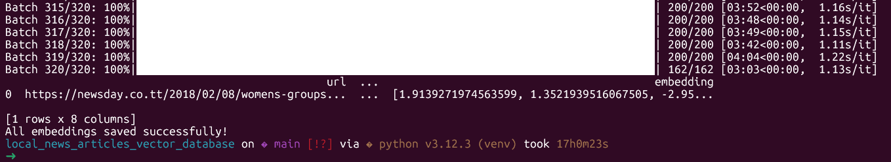
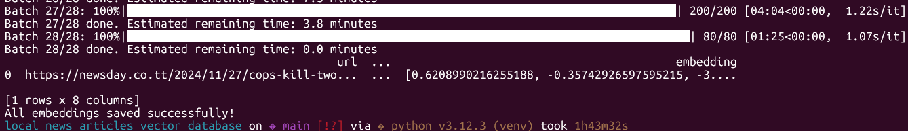

Here’s an updated README version with a section explaining the **Streamlit dashboard**, integrated with your existing structure:

---

# Vector Database Pipeline

This repository contains all the code, notebooks, and scripts used to scrape, clean, embed, and analyze news articles for storage inside a PostgreSQL vector database. It also includes a **Streamlit dashboard** for interactive exploration of clusters, trends, and similar articles.

---

## 📰 **1. Scraping News Articles (2017–2025)**

**Notebook:** `notebooks/scrape_newsday_articles.ipynb`

This notebook scrapes all Newsday articles from **2017 to November 22, 2025** and stores them locally for downstream processing.

---

## 🧹 **2. Cleaning & Preparing the Dataset**

**Notebook:** `notebooks/clean_news_data.ipynb`

Initially, embedding all articles (~64,000 records) took **17 hours** and resulted in a corrupted parquet file due to an incomplete footer. To prevent this issue and improve performance, only the **most recent 1 year of articles** is used.



---

## 🤖 **3. Setting Up Ollama for Local Embeddings**

**Script:** `setup_ollama_embeddings_cpu.zsh`

This script:

* Installs Ollama
* Starts the Ollama service
* Downloads the **nomic-embed-text** CPU‑optimized model
* Tests the installation

```zsh
#!/bin/zsh
set -e

curl --http1.1 -fsSL https://ollama.com/install.sh | sh
ollama serve > /dev/null 2>&1 &!
sleep 3

MODEL="nomic-embed-text"
ollama pull $MODEL

echo '{"prompt":"hello world"}' | ollama run $MODEL
```

---

## 🗄️ **4. Setting Up the Neon PostgreSQL Vector Database**

**Script:** `setup_db.py`

This script initializes the database schema, creates the necessary tables, and prepares the environment for storing vector embeddings.

---

## 🔢 **5. Generating Embeddings with Ollama (Batch CPU Pipeline)**

**Script:** `embed_articles_batch.py`

This script embeds the last year of articles using the **nomic-embed-text** model via Ollama. It supports:

* Batch processing (default: 200 articles per batch)
* Concurrent embedding with `ThreadPoolExecutor`
* Automatic resume from partial parquet files
* ETA estimation per batch



**Key functionality:**

* Reads partial embeddings if they exist
* Embeds only missing rows
* Saves progress after every batch
* Outputs a final `news_with_embeddings_1yr.parquet` file

---

## 📊 **6. Embeddings EDA (Exploratory Data Analysis)**

**Notebook:** `news_embeddings_EDA.ipynb`

This notebook performs a **full exploratory analysis** on the embeddings and extracted features.

### 🔍 **Summary of EDA steps**

1. Load and inspect data
2. Convert embeddings to numpy matrix
3. Semantic search using cosine similarity
4. KMeans clustering (9–10 clusters)
5. UMAP dimensionality reduction (2D + 3D)
6. Topic trends over time
7. Elbow + Silhouette score analysis
8. Cosine similarity heatmap
9. TF‑IDF keyword extraction
10. Wordclouds per cluster
11. Network graphs (NetworkX)

---

## 📊 **7. Streamlit Interactive Dashboard**

**File:** `app.py`


The Streamlit app provides an **interactive interface** for exploring news clusters, similar stories, and trends over time. Key features:

* **Home Tab** – Welcome screen with a dashboard title and image.
* **Cluster Topics Tab** – Shows 2D/3D UMAP visualizations, top keywords as word clouds, and example articles per cluster. Cluster labels are fully interpretable using `CLUSTER_INTERPRETATIONS`.
* **Similar Stories Tab** – Allows semantic search across articles, showing top `k` similar stories based on embeddings.
* **Cluster Trends Tab** – Plots the number of articles per cluster over time, with options to view **daily** and **smoothed weekly trends**.

**Features of the Streamlit app:**

* Hover only shows relevant metadata: `cluster_label`, `title`, `author`.
* Outliers in 3D UMAP removed for clarity.
* Word clouds aligned with cluster interpretations.
* Multi-select filters for clusters in trends.

**Run the app:**

```bash
streamlit run app.py
```

---

## 📁 **Folder Structure**

```
.
local_news_articles_vector_database
├── LICENSE
├── README.md
├── config.env
├── data
│   ├── news_last_1_year.parquet
│   ├── news_with_embeddings.parquet
│   ├── news_with_embeddings_1yr.parquet
│   ├── news_with_embeddings_1yr_partial.parquet
│   ├── news_with_embeddings_partial.parquet
│   └── newsday_articles_2018-02-08_to_2025-11-22.parquet
├── dataset
│   ├── cluster_keywords_100.json
│   └── news_last_1_year_clusters_umap.parquet
├── embed_articles_batch.py
├── images
│   ├── embeddings_batches_1year.png
│   ├── news_articles_picture.png
│   └── running_embed_batch_python_completion.png
├── notebooks
│   ├── clean_news_data.ipynb
│   ├── news_embeddings_EDA.ipynb
│   └── scrape_newsday_articles.ipynb
├── progress.txt
├── requirements.txt
├── setup_db.py
├── setup_ollama_embeddings_cpu.zsh
├── src
│   ├── app.py
│   ├── utils
│   │   ├── __pycache__
│   │   └── data_loader.py
│   └── views
│       ├── __pycache__
│       ├── cluster_topics.py
│       ├── cluster_trends.py
│       └── similar_stories.py
└── venv
```

---

## ✅ **Project Purpose**

This project builds a **scalable, local‑friendly vector search pipeline** using:

* Open‑source embedding models (Ollama)
* Python batch processing
* Neon PostgreSQL + vector extensions
* Jupyter notebooks for analysis
* Streamlit dashboard for interactive exploration

Perfect for:

* News monitoring
* Topic modeling
* Article similarity search
* Recommendation systems

---

